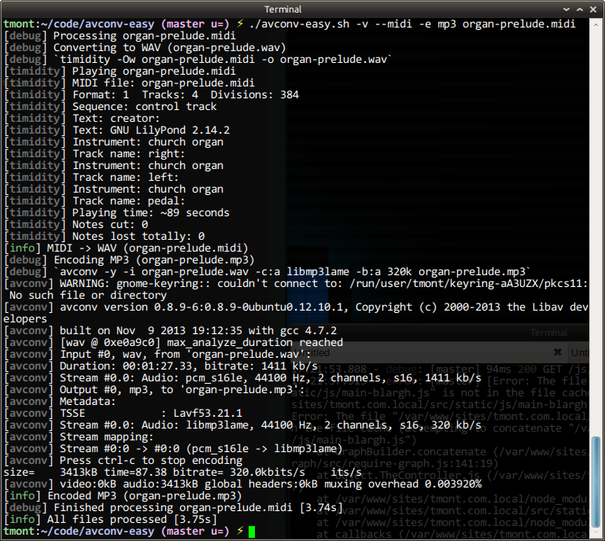

# avconv-easy
This is a little bash script I whipped up to make it more convenient
for me to run various `avconv` commands. Most notably:

1. Using `timidity` to convert a MIDI file to a WAV file
    - admittedly, this has nothing to do with `avconv`, so shut up
2. Encoding a WAV file (see 1.) as an MP3
3. Encoding a WAV file (see 1.) as an OGG (yes, I pronounce that as "AAUGH!!")

## Usage
```
--quiet
    Do not print anything
--verbose
    Print lots of boring details
-d,--dir directory
    Directory to place generated files in; if omitted, the
    current directory is assumed.
-e,--encoding mp3|ogg|mp3,ogg
    mp3:     Encode to mp3 using libmp3lame codec
    ogg:     Encode to ogg using libvorbis codec
    mp3,ogg: Encode to both mp3 and ogg
--midi
    Convert a MIDI file to WAV using timidity
--timidity /path/to/timidity
    timidity binary to use if not in path (only when --midi)
```

Sample output:


## Examples
Convert a MIDI file to a WAV, and then encode that WAV to MP3 and OGG
and put the resultant files in the same directory:

```bash
./avconv-easy.sh --midi --encoding mp3,ogg some/sweet/song.midi
```

Create an MP3 from some other file, while being really verbose and
put that MP3 in some other directory:

```bash
./avconv-easy.sh --verbose --encoding mp3 --dir songs lol-wma.wma
```

Just shut the hell up and do your job!

```bash
./avconv-easy.sh --quiet --encoding mp3 songs/*.wav
```